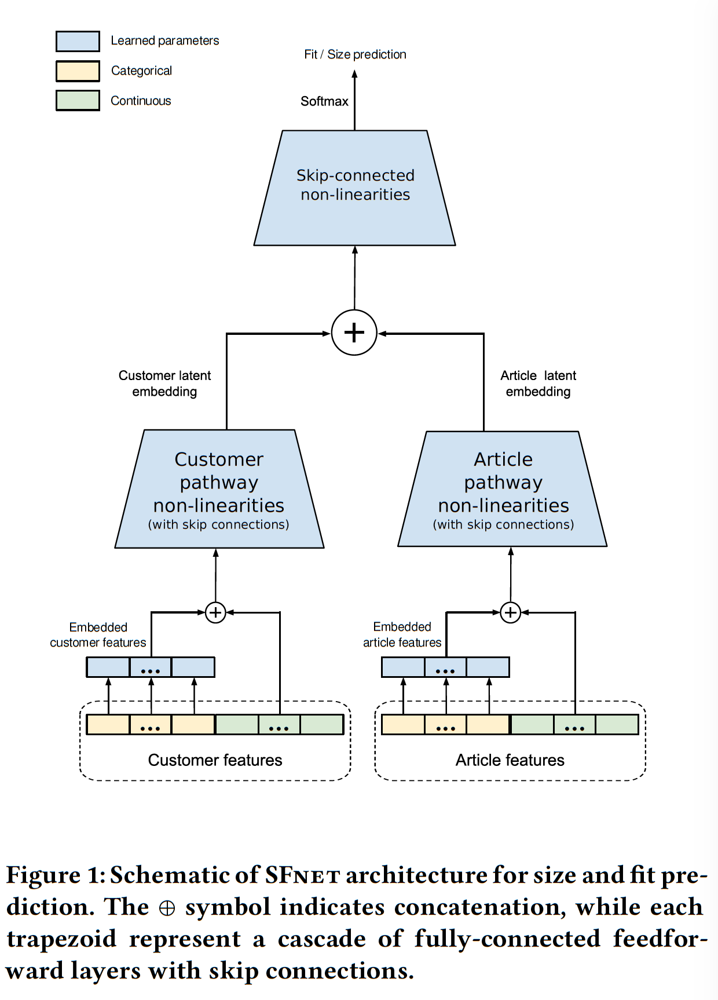
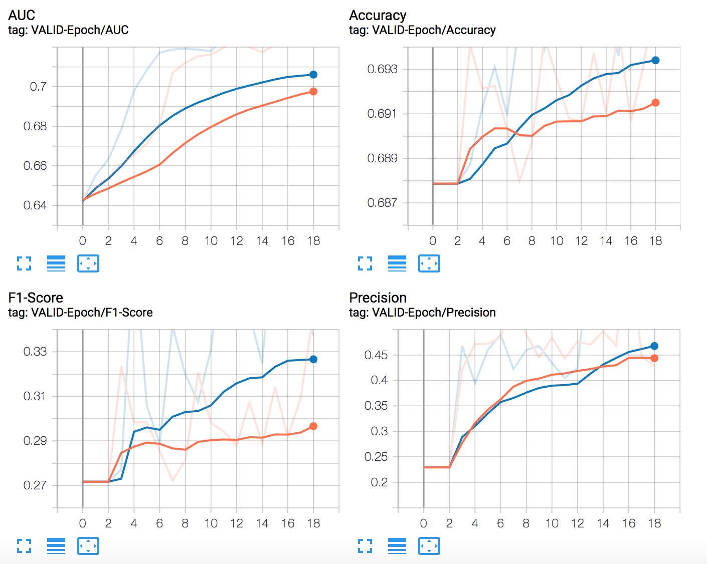

 

# A Deep Learning System for Predicting Size and Fit in Fashion E-Commerce

An (unofficial) PyTorch implementation of SizeFitNet (SFNet) architecture proposed in the paper [A Deep Learning System for Predicting Size and Fit in Fashion E-Commerce](https://arxiv.org/pdf/1907.09844.pdf) by Sheikh et. al (RecSys'19).

## Dataset
The original paper demonstrates experiments on two datasets:

1. ModCloth
2. RentTheRunWay

Both datasets are curated from fashion e-commerce websites that provide transaction information that contain `customer` attributes, `article` attributes and `fit` (target varible). `fit` is a categorical variable with `small`, `fit` and `large` as the possible labels.

## Model Architecture

The model consits of two pathways: one that captures user embeddings + user features, the other that captures item embeddings + item features. See the following figure taken from paper:

<br>

<br>

The representations within each pathway is transformed using residual/skip connections. The authors compare it against an MLP (without skip connections) baseline and show better performance. 

Different from the paper, I combine the user representation (u) and item representation (v) into a new tensor as below:
```
   [u, v, |u-v|, u*v]
```
- concatenation of the two representations
- element-wise product u ∗ v
- absolute element-wise difference |u-v|

Based on: https://arxiv.org/pdf/1705.02364.pdf

This new representation is fed to the top layer skip connection block.

## Instructions

1. Start by installing the necessary packages (preferably within a Python virtual environment):
```
   pip install -r requirements.txt
```

2. Download the data from [here](https://www.kaggle.com/rmisra/clothing-fit-dataset-for-size-recommendation) and place it in the `data/` directory.

3. The original data is quite messy with quite a bit of missing values (NaNs). As such, I dropped some attributes and did some data imputation. Refer to the `data_exploration.ipynb` notebook to understand the data processing steps. The notebook also provides instruction on creating the train/validation/test splits. 

4. Set data, model and training configurations by appropriately modifying the `jsonnet` files under `configs/` directory.

5. Train the SFNet Model:
```
   python train.py
```
The model checkpoints and run configuration will be saved under `runs/<experiment_name>`
The above also generates tensorboard plots of training loss and validation metrics, that would be useful to view training progress.

6. Test the Model:
```
   python test.py --saved_model_path `runs/<experiment_name>`
```

## Primary Results
The model was quite sensitive to hyperparameters. For certain sets of hyperparameters, the optimization process would diverge and the validation loss would shoot up. The configuration provided under `configs/model.jsonnet` was what worked best for me. 

### Learning Curves
Below are some tensorboard graphs for validation metrics. 

<br>

<br>

### Performance on Test Set

| Precision| Recall  | F1-score | Accuracy |  AUC  |
|:--------:|:-------:|:--------:|:--------:|:-----:|
| 0.682    | 0.397   |   0.378  | 0.691    | 0.728 | 

*Note*: The metrics reported here are macro-average values. 


## TODO
Some future work for this repository and ideas are plausible ways to improve the results:
* Experiments on RentTheRunWay Dataset
* L2-regularization on the embeddings
* Batch Normalization on the feed forward layers
* Early Stopping
* Learning Rate Decay
* Weighted Loss Function to account for the class-imbalance
* Contrastive Learning (Siamese Networks-?) to encourage learning different sub-spaces for positive and negative size-fits
* Topic Modelling Approaches
* Modelling Users/Items as Distributions

## Acknowledgements
Thanks to Rishab Mishra for making the datasets used here publicly available on [Kaggle](https://www.kaggle.com/rmisra/clothing-fit-dataset-for-size-recommendation). Some ideas for pre-processing the data were borrowed from [NeverInAsh](https://github.com/NeverInAsh/fit-recommendation).
